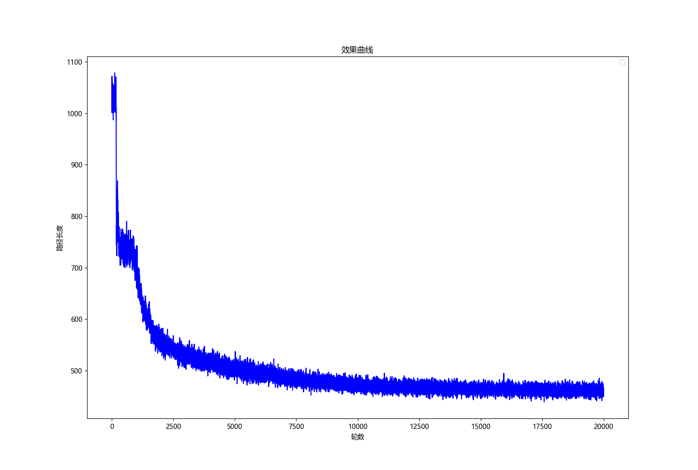

# Actor-Critic解决旅行商问题
本仓库为[PointerNetwork-RL-TSP](https://github.com/zifeiyu0531/PointerNetwork-RL-TSP)的pytorch实现版本

训练
```
python main.py --training_mode True
```

推理
```
python main.py --training_mode Flase
```

具体config参考代码`model\config.py`

模型文件保存于save文件夹中


